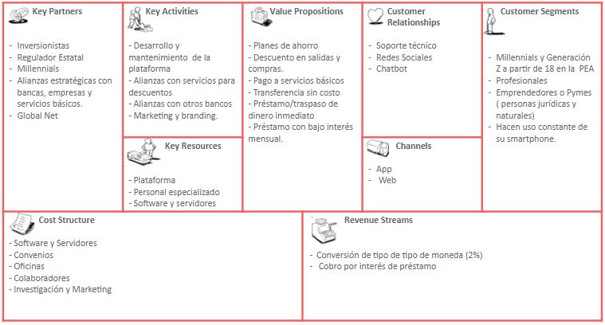
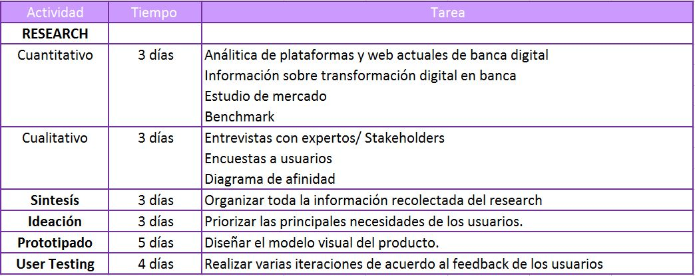

# Banca Digital
El Banco del País es uno de los bancos más importante del país. Esta institución actualmente está pasando por un proceso de transformación digital. Como parte de este proceso, han implementado un área de innovación que quiere llegar de una mejor manera a los usuarios más jóvenes (millennials).
## DESCUBRIMIENTO E INVESTIGACIÓN
Realizamos la búsqueda de información  online (webs, foros, videos, etc) sobre nuestro público objetivo(Millenials) para poder conocer
sus características , también sobre el impacto de la tecnología en las finanzas (Fénomeno Fintech).

***FENÓMENO FINTECH***

Las finanzas están cambiando su modelo de trabajo luego del desarrollo en tecnología que está insertándose en el sistema y en este contexto aparecen las fintech, plataformas tecnológicas de servicios financieros enfocadas en atender las necesidades de los usuarios.

En el Perú, las Fintech están comenzando a aparecer con mucho éxito. Nuestro país ocupa el cuarto lugar en emprendimiento en Latinoamérica, pues 25 de cada 100 peruanos están involucrados en una actividad emprendedora, por lo que las Fintech se ha convertido en una propuesta muy cercana al ciudadano de pie.

Los múltiples beneficios que ofrecen las Fintech al emprendedor actual son muchas, sobre todo porque le otorga al ciudadano el control de sus finanzas desde cualquier dispositivo móvil. Asimismo, el simple hecho de no tener que acercarse hasta un banco y realizar largas colas. Las Fintech ofrecen un servicio claro, sencillo y te genera un ahorro de tiempo.

## CARACTERÍSTICAS DE LOS MILLENNIALS
- ***No hay vida sin Internet:*** Es necesario que estén conectados siempre, y para eso recurren a dispositivos como smartphones, tablets y notebooks. Desde actividades de ocio (mirar películas), comprar productos o hasta socializar con personas, siempre lo hacen con la más reciente aplicación o web.

- ***Visión carpe diem***: Ponderan el presente por sobre todas las cosas, quieren vivir el momento actual intensamente y buscan la felicidad y la pasión en todo lo que hacen. Esto genera un cambio importante, ya que mientras que para las generaciones anteriores el sinónimo del éxito estaba siempre más relacionado con las posiciones jerárquicas en lo laboral, los millennials ponderan el trabajar de lo que les gusta por sobre el ejercicio del poder o incluso lo material.

- ***Movilidad laboral:*** Cuando sienten que su trabajo ya no representa un reto, lo dejan sin remordimientos y buscan otro en donde se sientan más a gusto y que pueden aportar más. También, dado que suelen ser multifacéticos, es probable que tengan varios trabajos free-lance simultáneos. En USA se estima que un joven cambia 15 veces de trabajo antes de cumplir los 38 años. Eso demuestra el desapego que existe para esta generación en lo referente a lo laboral.

- ***Participación y crítica:*** Son participativos y les gusta compartir sus conocimientos. Están a favor de democratizar la información y el contenido de manera gratuita. Además, no confían en todo lo que las empresas les dicen e investigan en la web antes de tomar cualquier decisión de consumo.

- ***Poca posesión, mucho disfrute:*** No anhelan tener casa ni auto propio. Tampoco son adeptos de acumular bienes. El único gasto que priorizan es el de su smartphone. Prefieren disfrutar, viajar y la inversión en “experiencias” por sobre la posesión física de las cosas, cualesquiera que sean.

## Benchmarking
Realizamos un estudio de Benchmarking , nos ofrece un contexto de comparación inmediato con respecto a nuestros iguales (competidores directos e indirectos) permitiéndonos saber si estamos haciendo bien las cosas o bien tenemos margen para mejorarlas y detectar oportunidades, amenazas así como debilidades y fortalezas que provienen de nuestro entorno de competidores.
El estudio lo realizamos a apps como NEQUI , SIMPLE , NUBANK , N26 , INTERBANK , BBV.
https://docs.google.com/document/d/1vPzSmaW6GcFcl4l-dQr2_pNxDVX0fIY7o4ghYJXj2Ko/

## RESEARCH
Se realizó las encuestas que fueron enviadas a un público de alrededor 40 personas a través de internet, con la finalidad de darnos una idea de la situación actual , características de los usuarios , comportamientos financieros , preferencias , problemática , etc. Obtener data cuantitativa y cualitativa.
Para esta fase del proceso se usaron las siguientes herramientas:

- Google form

https://docs.google.com/forms/d/1WEBJCd7-9ks6r7CqmCFKfu7C8MQJNB1BgD8T9SsFpEE/edit#responses

# SÍNTESIS Y DEFINICIÓN

## MAPA DE AFINIDAD
Se realizó un diagrama de Afinidad con la finalidad de poder analizar los datos obtenidos de las encuestas y entrevistas y agruparlos de acuerdo a las similutes  de las respuestas. Agrupamos toda la información en Categorias.
Los temas encontrados fueron :
- Utilizan tarjetas de crédito o débito
- Transacciones Online
- Transacciones en la entidad bancaria
- Beneficios  más frecuentes al realizar transacciones Online:
   - Ahorro de Tiempo
   - facil
   - rapidez
   - Comodidad
- Problemas más frecuentes al realizar transacciones Online:
   - No cumplir con los tiempos de entrega pactados
   - Seguridad
-Transacciones financieras más frecuentes:
   - Prestamos
   - Transferencias
   - Ahorro
   - Pago de Servicios
 -Metas de Ahorro:
   - Viajes
   - vivienda
   - Estudios
   - Imprevistos
 - Principales caracteristicas llamativas para los usuarios
   - Promociones
   - Descuentos

Luego de analizar todo la información obtenida, nos dimos cuenta de que de las categorías en transacciones frecuentes fueron Transferencias y Pago de servicios,
tambien notamos  que los usuarios se veían muy influenciados por beneficios Como descuentos , promociones etc  ,estos fueron los puntos que  más coincidencia  tuvieron nuestros usuarios por ello decidimos abordar estas categorías para la obtención de nuestra problemática.

## STAKEHOLDERS
- CEO
- Gerente de Marketing
- Jefe de innovación
- Gerente de Banca
- Asesor legal
- Jefe de ventas
- Regulador estatal
- Funcionario de SBS
- Millenialls

## REUNIÓN KICK OFF
[**AGENDA DE ACTIVIDADES**](http://docs.google.com/document/d/1_vooE_yBEE2rj1v3dcruDtJjUTviaZnZblBrozv6L0I/edit)

### PREGUNTAS
**Cliente Interno**

*CEO*
- ¿Cuál es el problema principal que se quiere resolver con la implementación de una banca digital?
- ¿Qué servicios se desean priorizar?
- ¿Qué resultados esperan del proyecto?

*Gerente de marketing*
- ¿Qué producto es el más rentable?
- ¿Cuál es el porcentaje de clientes nuevos del año anterior?
- ¿Cuál es el porcentaje de clientes perdidos del año anterior?
- ¿Cuál es el valor diferencial de su servicio?

*Jefe de innovación*
- ¿Qué tan conformes están al cambio?
- ¿Qué servicios además de los que ya tiene online le gustaría implementar?

*Regulador estatal*
- ¿Cuáles son las limitaciones al realizar transacciones online/vía app?

## BUSINESS MODEL CANVAS

## PLAN DE INVESTIGACIÓN
### OBJETIVOS
- Comprender mejor qué información es relevante para los millennials.

- Conocer qué información motiva a los millennials a tomar decisiones financieras ¿Qué les importa a los millennials? ¿Qué los motiva?

- Conocer información  sobre las frustraciones  de los millennials , lo que los frustra no solo desde una perspectiva digital, sino también no digital. desde el momento en que el cliente entra al banco y habla con el personal, hasta la salida del establecimiento.Todos los detalles.La experiencia de usuario es todo. ¿Qué frustra a tus usuarios? ¿Qué necesidades tienen que no están siendo satisfechas?

- Conocer la interacción de los millennials con su entorno, tener una perspectiva holística nos dará una mejor idea del contexto del por qué toman ciertos caminos.

**HERRAMIENTAS**
- Benchmarking
- Encuestas
- Entrevistas a profundidad
- Diagrama de afinidad
- Testing

**ACTIVIDADES PLANEADAS**

### Miembros
- Flora María
- Ruth Matos
